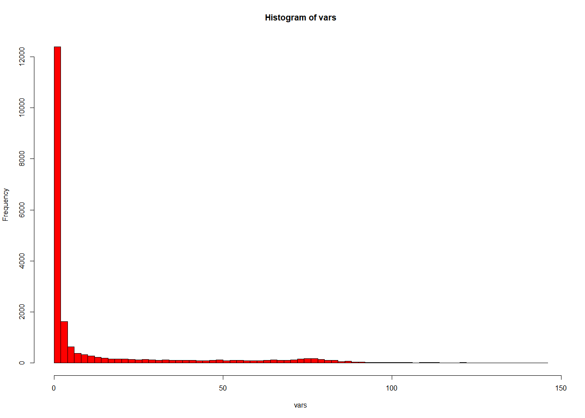
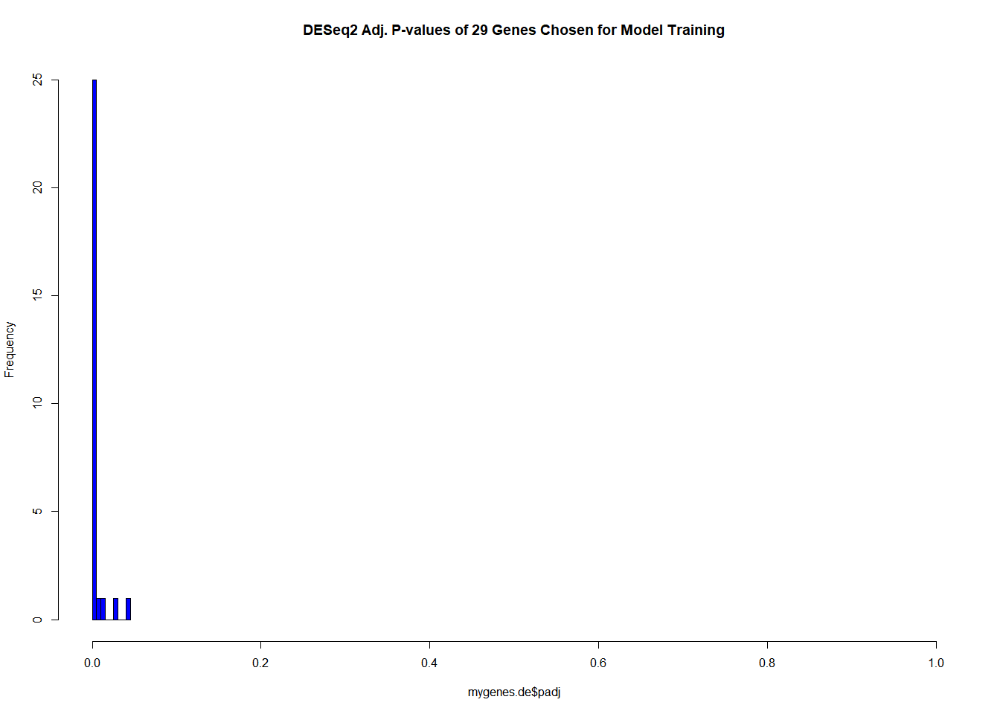
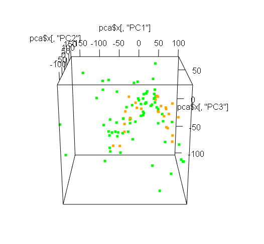

ML Predictive Models For Cancer
================
Author: John Paul Wick

16 September 2024

- [1 Data Loading, Partitioning, and
  Normalization](#1-data-loading-partitioning-and-normalization)
- [2 Exploration of Variance in the
  Data](#2-exploration-of-variance-in-the-data)
- [3 Gene Correlation](#3-gene-correlation)
- [4 Principal Component Analysis](#4-principal-component-analysis)
- [5 Model Development](#5-model-development)
- [6 Model Testing](#6-model-testing)
- [7 Conclusions](#7-conclusions)
- [8 References:](#8-references)

# 1 Data Loading, Partitioning, and Normalization

In the code chunk below, I load and pre-process the data. I choose 100
samples for training data (samples 64-163 which have balanced classes of
control and disease) and create a new summarized experiment object for
them. Then I set aside the remaining 126 samples for later testing, and
create another summarized experiment object for them. I also will
include only protein coding genes in the data as these are of most
interest for these models. The training and testing data are both
normalized in the same way for consistency.

Note: I decide here to use the unstranded data as opposed to the
stranded data. When surveying the counts, it appears that there are
higher counts in the unstranded data than the stranded assays, and that
the reverse- and forward- stranded assays have quite balanced counts
which more or less add up to the unstranded counts (each stranded
direction accounts for about 50% of the data). These are potential
indications of the original data being unstranded (Signal, 2022), so I
believe that this assay will be the most reliable. Unstranded data
appears to be the default for TCGA projects, and is used by TCGA in
their own analyses for consistency across projects (see these posts:
<https://www.biostars.org/p/9536035/>,
<https://www.biostars.org/p/343933/>).

``` r
library(DESeq2); library(SummarizedExperiment)
# SWD to where I saved the Summarized Experiment object:
setwd("C:/Users/John Paul/OneDrive/Brandeis Bioinformatics MS/Course 112 (Mathematical Modeling)/Week 10/Final Project Data")
# Loading it in:
load("finalprojectdata_se.RData")
data
```

    ## class: RangedSummarizedExperiment 
    ## dim: 60660 226 
    ## metadata(1): data_release
    ## assays(6): unstranded stranded_first ... fpkm_unstrand fpkm_uq_unstrand
    ## rownames(60660): ENSG00000000003.15 ENSG00000000005.6 ...
    ##   ENSG00000288674.1 ENSG00000288675.1
    ## rowData names(10): source type ... hgnc_id havana_gene
    ## colnames(226): TCGA-5L-AAT0-01A-12R-A41B-07
    ##   TCGA-A2-A04U-01A-11R-A115-07 ... TCGA-BH-A1EO-11A-31R-A137-07
    ##   TCGA-AC-A23H-11A-12R-A157-07
    ## colData names(87): barcode patient ... paper_PARADIGM Clusters
    ##   paper_Pan-Gyn Clusters

``` r
assays(data)
```

    ## List of length 6
    ## names(6): unstranded stranded_first ... fpkm_unstrand fpkm_uq_unstrand

``` r
# Looks good! I'm ready to split into training and testing data and normalize.


################################################################################################################


################# TRAINING DATA SETUP ###################

# First I see what the pre-normalized (fpkm) assay looks like among the training data.
ge <- assays(data)[[5]] # the unstranded, pre-normalized data (using fpkm)
ge_pc <- ge[rowData(data)$gene_type == "protein_coding",]
ge_pc_smaller <- ge_pc[,64:163] # keeping just 50 samples of each condition for training data (64-163) All the other samples will be set aside for testing. 

# Now we have a df of just the protein coding genes for the training samples which will be the focus here. 
dim(ge_pc_smaller)
```

    ## [1] 19962   100

``` r
boxplot(log2(ge_pc_smaller+0.00001), col="cyan")
```

<!-- -->

``` r
# There is still room for improvement, so I'll try the DESeq2 method. 
# This needs to be done on the raw counts (integers) so I use the first assay this time:
ge <- assays(data)[[1]] # the unstranded, unnormalized data
ge_pc <- ge[rowData(data)$gene_type == "protein_coding",]
ge_pc_smaller <- ge_pc[,64:163] # keeping just 50 samples of each condition for training
meta <- data.frame(sampletype = colData(data)[64:163,11])
dds=DESeqDataSetFromMatrix(countData=ge_pc_smaller, colData=meta, design = ~sampletype)

# Before I normalize the data, I quickly perform a DESeq2 analysis to find differentially expressed genes.
# This will be useful in model building, as this is the training data.
# I save the resulting table for later:
dds.de <- DESeq(dds)
de.results <- results(dds.de)
de.results <- de.results[complete.cases(de.results),]

# Now I get back to the normalization
dds=estimateSizeFactors(dds)
ge = sweep(ge_pc_smaller,2,sizeFactors(dds),FUN="/")
ge = log2(ge+0.00001)
boxplot(ge, col="cyan")
```

<!-- -->

``` r
# Once again, the DESeq2 method normalizes the data the best!
# So, I'll use this normalization method for both my training and testing data and go ahead and set up SE objects.

# So now I have ge (DESeq2-normalized unstranded count data of protein-coding genes for samples 64-163 - the training samples)
dim(ge)
```

    ## [1] 19962   100

``` r
# I get colData for just those training samples:
colData <- colData(data)[64:163,]
dim(colData)
```

    ## [1] 100  87

``` r
# I get the rowData for just those genes (protein-coding):
rowData <- rowData(data)[rowData(data)$gene_type == "protein_coding",]
dim(rowData)
```

    ## [1] 19962    10

``` r
# And I save, importantly, outcomes for those training samples.
# This will be our reference to help build the models later:
trainingoutcomes <- colData[,11]
length(trainingoutcomes)
```

    ## [1] 100

``` r
# Finally, I define the SE object with just the information I will use or training
trainingdata <- SummarizedExperiment(
  assays = list(counts = ge),
  rowData = rowData,
  colData = colData
)

# Summary:
trainingdata
```

    ## class: SummarizedExperiment 
    ## dim: 19962 100 
    ## metadata(0):
    ## assays(1): counts
    ## rownames(19962): ENSG00000000003.15 ENSG00000000005.6 ...
    ##   ENSG00000288674.1 ENSG00000288675.1
    ## rowData names(10): source type ... hgnc_id havana_gene
    ## colnames(100): TCGA-E2-A156-01A-11R-A12D-07
    ##   TCGA-A7-A56D-01A-11R-A27Q-07 ... TCGA-BH-A0B7-11A-34R-A115-07
    ##   TCGA-E9-A1NG-11A-52R-A14M-07
    ## colData names(87): barcode patient ... paper_PARADIGM Clusters
    ##   paper_Pan-Gyn Clusters

``` r
################################################################################################################


################# TESTING DATA SETUP ###################


# Now I create a testingdata SE object for the remaining samples:
ge <- assays(data)[[1]] # the unstranded, unnormalized data
ge_pc <- ge[rowData(data)$gene_type == "protein_coding",] # only protein coding again
ge_pc_smaller <- ge_pc[,-c(64:163)] # the rest set aside for testing

# Normalize and prepare these in the same way as the training data above, for consistency.
meta <- data.frame(sampletype = colData(data)[-c(64:163),11])
dds=DESeqDataSetFromMatrix(countData=ge_pc_smaller, colData=meta, design = ~sampletype)
dds=estimateSizeFactors(dds)
ge = sweep(ge_pc_smaller,2,sizeFactors(dds),FUN="/")
ge = log2(ge+0.00001)
#boxplot(ge, col="cyan")

# So now I have ge (DESeq2-normalized unstranded count data of protein-coding genes for all testing samples)
dim(ge)
```

    ## [1] 19962   126

``` r
# I get colData for just those testing samples:
colData <- colData(data)[-c(64:163),]
dim(colData)
```

    ## [1] 126  87

``` r
# I get the rowData for just those genes (protein-coding):
rowData <- rowData(data)[rowData(data)$gene_type == "protein_coding",]
dim(rowData)
```

    ## [1] 19962    10

``` r
# And I save, importantly, outcomes for those testing samples (this will just be to compare with predictions later!):
testingoutcomes <- colData[,11]
length(testingoutcomes)
```

    ## [1] 126

``` r
# Finally, I define the SE object with just the information I will use for testing
testingdata <- SummarizedExperiment(
  assays = list(counts = ge),
  rowData = rowData,
  colData = colData
)

# Summary:
testingdata
```

    ## class: SummarizedExperiment 
    ## dim: 19962 126 
    ## metadata(0):
    ## assays(1): counts
    ## rownames(19962): ENSG00000000003.15 ENSG00000000005.6 ...
    ##   ENSG00000288674.1 ENSG00000288675.1
    ## rowData names(10): source type ... hgnc_id havana_gene
    ## colnames(126): TCGA-5L-AAT0-01A-12R-A41B-07
    ##   TCGA-A2-A04U-01A-11R-A115-07 ... TCGA-BH-A1EO-11A-31R-A137-07
    ##   TCGA-AC-A23H-11A-12R-A157-07
    ## colData names(87): barcode patient ... paper_PARADIGM Clusters
    ##   paper_Pan-Gyn Clusters

In the code above, I loaded in the TCGA dataset obtained TCGA-BRCA project,
in the form of a SummarizedExperiment object. Of all 226
samples, I select only 50 samples from each group (control and disease
type), samples 64-163, for training data. In the code chunk above, I
select only those 100 samples; I select only the protein-coding
transcripts as these are of most importance to me; and I re-define the
SummarizedExperiment object to include only these data and metadata.
This new SummarizedExperiment thus contains the information I will use
to train predictive classifier models.

Then, I defined another SE object for the testing data, using all of the
remaining 126 samples. This data is set aside, and is “off-limits” until
it is time to make predictions using my final models. These data are
meant to mirror completely unknown data (as though they were not
available to me during training of the models). The reason I am making
this training/testing split so early is so that the testing data cannot
influence in any way the construction of the models. So the exploration
of data and training of the models is done only with access to the
trainingdata SE object. This way, the classes are also balanced in the
training data to minimize any possible bias towards positive or negative
predictions in the models.

At this point, I am ready for the exploration of the training data. With
the training data now formatted in a new SE object, as well as
differential expression analysis results, I begin to explore the data,
searching for correlations between genes and metadata variables, and
probing for appropriate combinations of genes to use to train the
models.

# 2 Exploration of Variance in the Data

The first thing I do is identify and remove genes with no variance
(these are the genes which were not detected at all in any of the
samples). There is no reason to keep these as they are not helpful (in
addition, PCA cannot be performed if there are variables with no
variance). In the code below, I use the training data to identify 597
rows with a variance of zero, then I remove them (I also remove them
from the testing data to keep formatting consistent).

Then, I order the genes by decreasing variance and examine the top
genes. Genes with the highest variance can be the best predictors, as
differences between groups are exaggerated. I will select a subset of
the highest-variance genes for model building.

``` r
# USE JUST TRAINING DATA SE FOR THIS

# Sort by variance, choose cutoff and exclude all genes below the 
vars <- apply(assays(trainingdata)[[1]],1,function(x) var(x))
min(vars) # looks like there are genes with zero variance (not detected in any samples)
```

    ## [1] 0

``` r
hist(vars, breaks=100, col="red")
```

<!-- -->

``` r
# I remove all genes which have zero variance! These will not be helpful at all. Then I redefine the trainingdata SE object to not include those genes.
zero_var_indices <- as.vector(which(vars==0))
length(zero_var_indices)
```

    ## [1] 597

``` r
# The colData will remain the same since I am not removing samples.
colData <- colData(trainingdata)
#I just need to update the assay and the row data.
ge <- assays(trainingdata)[[1]][-c(zero_var_indices),]
dim(ge)
```

    ## [1] 19365   100

``` r
# I get the rowData for just those genes (protein-coding):
rowData <- rowData(trainingdata)[-c(zero_var_indices),]
dim(rowData)
```

    ## [1] 19365    10

``` r
# Redefine the training data SE object:
trainingdata <- SummarizedExperiment(
  assays = list(counts = ge),
  rowData = rowData,
  colData = colData
)
# Summary:
trainingdata
```

    ## class: SummarizedExperiment 
    ## dim: 19365 100 
    ## metadata(0):
    ## assays(1): counts
    ## rownames(19365): ENSG00000000003.15 ENSG00000000005.6 ...
    ##   ENSG00000288674.1 ENSG00000288675.1
    ## rowData names(10): source type ... hgnc_id havana_gene
    ## colnames(100): TCGA-E2-A156-01A-11R-A12D-07
    ##   TCGA-A7-A56D-01A-11R-A27Q-07 ... TCGA-BH-A0B7-11A-34R-A115-07
    ##   TCGA-E9-A1NG-11A-52R-A14M-07
    ## colData names(87): barcode patient ... paper_PARADIGM Clusters
    ##   paper_Pan-Gyn Clusters

``` r
# Now I need to repeat the process for the test data. The reason for this is that the models, when making predictions, need the new unseen data to have the same gene names exactly as the training data. This may not be necessary if I subset the test data in the same way as I did when training the model on only a few selected features of the training data, but I'd prefer if the SE objects match dimensions. 
# The colData will remain the same since I am not removing samples.
colData <- colData(testingdata)
#I just need to update the assay and the row data.
ge <- assays(testingdata)[[1]][-c(zero_var_indices),]
dim(ge)
```

    ## [1] 19365   126

``` r
# I get the rowData for just those genes (protein-coding):
rowData <- rowData(testingdata)[-c(zero_var_indices),]
dim(rowData)
```

    ## [1] 19365    10

``` r
# Redefine the training data SE object:
testingdata <- SummarizedExperiment(
  assays = list(counts = ge),
  rowData = rowData,
  colData = colData
)
# Summary:
testingdata
```

    ## class: SummarizedExperiment 
    ## dim: 19365 126 
    ## metadata(0):
    ## assays(1): counts
    ## rownames(19365): ENSG00000000003.15 ENSG00000000005.6 ...
    ##   ENSG00000288674.1 ENSG00000288675.1
    ## rowData names(10): source type ... hgnc_id havana_gene
    ## colnames(126): TCGA-5L-AAT0-01A-12R-A41B-07
    ##   TCGA-A2-A04U-01A-11R-A115-07 ... TCGA-BH-A1EO-11A-31R-A137-07
    ##   TCGA-AC-A23H-11A-12R-A157-07
    ## colData names(87): barcode patient ... paper_PARADIGM Clusters
    ##   paper_Pan-Gyn Clusters

``` r
###############################################################################

# Now I make sure that all zero-variance genes have been removed:
vars <- apply(assays(trainingdata)[[1]],1,function(x) var(x))
min(vars)
```

    ## [1] 0.04845563

``` r
# Ordering the genes by variance and examining the top ones:
# make new df of this: ordered_var

var_ordered <- assays(trainingdata)[[1]][order(vars, decreasing=TRUE),] # using training data only

plot(rev(apply(var_ordered,1,function(x) var(x))), col="magenta", main="Ordered Variances of Genes in Training Data")
abline(h=rev(sort(vars))[200], col="red", lwd=3, lty=3)
```

<!-- -->

For now, I choose the top 200 for further analysis. First, I want to
find which of these top genes may be good predictors. I will assess this
by running t-tests for each gene between disease and control samples. I
will also look at their DE adjusted p-values from the DESeq2 analysis.

``` r
# Run t-tests for each gene on first 50 samples (cancer) vs second 50 samples (control).
ttpvals <- apply(var_ordered[1:200,],1,function(x) t.test(x[1:50],x[51:100])$p.value)
# Get the IDs of the significant genes of these top genes
names <- names(ttpvals[ttpvals < 0.05]) 
# Subset the DESeq2 results so I have them just for these significant genes:
mygenes.de <- de.results[names,]
# Get the IDs of the genes which are also significant in the DE analysis:
names <- rownames(mygenes.de[mygenes.de$padj<0.05,])

length(names)
```

    ## [1] 110

``` r
# Saving the data on these genes to a new df:
genes_of_interest <- var_ordered[names,]
dim(genes_of_interest)
```

    ## [1] 110 100

I found 110 genes which fulfilled 3 criteria: being in the top
percentile for variance, having significant t-test results, and having
significant adjusted p-value in the DESeq2 analysis. There is one last
test: I want to find the subset of these 110 genes which are not
correlated with each other.

# 3 Gene Correlation

Interestingly, nearly all the protein-coding genes are significantly
differentially expressed between disease and control samples, as seen
from the histogram below of the DESeq2 results. What is surprising,
given the proportion of genes with near-zero variance as seen in the
histogram above, is the very high proportion which are significantly
differentially expressed. I want to use as many of the high variance
genes as I can while avoiding highly correlated genes (using highly
correlated variables introduces unnecessary complexity in models,
leading to overfitting).

``` r
library(corrplot)

# First, I plot a histogram of adjusted p-values from the DESeq2 analysis. This analysis may be helpful later for variable selection.
hist(de.results$padj, col="purple", main="Adjusted P-Values for DE Analysis (training data")
```

<!-- -->

``` r
# Correlation matrix setup:
cor_matrix<-cor(t(genes_of_interest)) # top 50 genes used
corrplot(cor_matrix, method="circle")
```

<!-- -->

After careful visual inspection and consideration of this correlation
plot, I select 29 genes which appear to each be uncorrelated with all
other genes in the set. I update the genes_of_interest dataframe and
make a new correlation plot to demonstrate the lack of correlation.
While there are a number of cutoffs I could choose, my selections have
maximum correlation strength of less than 0.5. I also prefer to have
around 30 genes at my disposal for model training, which influenced my
decisions and cutoff.

``` r
# From this plot, I want to find genes which have minimal correlation with all other genes.
# From visual inspection of the plot, I select some genes which appear to have low correlation to all others.

# Indices:
ind <- c(7,8,20,21,25,28,32,34,35,43,45,55,58,61,62,73,79,80,81,82,88,89,98,99,100,106,107,109,110) # 29 genes
genes_of_interest <- genes_of_interest[ind,]
dim(genes_of_interest)
```

    ## [1]  29 100

``` r
# To confirm these are uncorrelated, I make a new correlation matrix for them and plot it as before:
cor_matrix<-cor(t(genes_of_interest))
corrplot(cor_matrix, method="circle")
```

<!-- -->

This looks much better! I also plot a histogram of the correlation
coefficients (excluding the 1’s, which represent where each gene lines
up with itself in the matrix giving perfect correlation) to demonstrate
the lack of correlation among all 29 genes chosen for model training.
The maximum absolute value of the correlation coefficients for all
combinations of these 29 genes is 0.37. I include histograms showing the
t-test p-values and DE adjusted p-values.

``` r
cors <- as.vector(cor_matrix)
hist(cors[cors != 1], col="yellow", xlim = c(-1,1), main="Correlation Coefficients of Top 29 Genes Chosen for Model Building", breaks = 50)
```

<!-- -->

``` r
# Finding strongest correlation:
max(abs(cors[cors != 1]))
```

    ## [1] 0.3751598

``` r
# Strongest correlation is of strength 0.37!

# Plotting t-test of p-values for these 29 genes
ttpvals <- apply(genes_of_interest,1,function(x) t.test(x[1:50],x[51:100])$p.value)
hist(ttpvals, col="blue", main="T-test P-values of 29 Genes Chosen for Model Training", xlim=c(0,1))
```

<!-- -->

``` r
# Plotting DESeq2 Adjusted P-values:
gene_names <- rownames(genes_of_interest)
mygenes.de <- de.results[gene_names,]
hist(mygenes.de$padj, col="blue", main="DESeq2 Adj. P-values of 29 Genes Chosen for Model Training", xlim=c(0,1))
```

<!-- -->

In the following code, I perform a hierarchical clustering analysis on
the chosen set of genes and identify two primary clusters (these likely
represent genes which are up in control and down in disease, and down in
control and up in disease, respectively). Next I display a heatmap
showing the intersection with a sample cluster. Interestingly, the
samples did not form clean clusters - they mostly separated into disease
and control samples, but there are a few mismatches as well. Regardless,
the two gene clusters appear to stratify across the two sample clusters
as a whole, so that distinct regions of the heatmap line up with the
clusters displaying the differential expression. While it’s not the
cleanest, the differences are definitely visible (and perhaps if the
samples clustered together better, the differences would be even
clearer).

``` r
# Finally, I make a heatmap of the genes by sample:
library(gplots); library(topGO); library(RColorBrewer)

# Supporting functions for heatmap and clustering:
redgreen <- function(n) { c(hsv(h=2/6, v=seq(1,0,length=n/2) ), hsv(h=0/6, v=seq(0,1,length=n/2)) ) }
corr.dist=function(x) { as.dist(1-cor(t(x))) }


# in order to be able to cut it later:
hc=hclust(corr.dist(genes_of_interest),method="ward.D2")
# plot the dendrogram
plot(hc,lab=F)
# plot a cut at branch height 2 and see if we get what we need:
rect.hclust(hc,h=2)
```

<!-- -->

``` r
clusters=cutree(hc,h=2) 
rcol = brewer.pal(10,"Paired")[clusters]


# While not perfect, we do see clustering of these genes intersect with clustering of the samples! (For some reason, the sample clustering also doesn't separate perfectly).
heatmap.2(genes_of_interest,trace="none",labCol=colnames(genes_of_interest),
          ColSideColors=c(rep("blue",50), rep ("orange",50)),col=redgreen(100),
          scale="row",labRow=F,distfun=corr.dist,margin=c(7,7),
          key=F, hclustfun=function(x) { hclust(x,method="ward.D2")},
          RowSideColors=rcol)
```

<!-- -->

I have what seems to be a pretty good set of 29 genes I can use for
model training. These 29 genes are in the top 200 of all nearly 20k
genes (about the top percentile) for variance, they are all uncorrelated
with one another, and they all have significant results with both
t-tests and DE analysis. The plots in the above section support the
hypothesis that this particular set of 29 genes will be good for model
building.

I will next explore the correlation of these genes with some metadata
columns (including my target column of sample type). I will also assess
the correlation of some of these metadata with each other. While I don’t
expect this to have a drastic effect on my approach to model building,
this type of analysis is always important in understanding the data and
how it was generated.

I should hope to see little correlation between the genes and the
metadata (besides the sample type); otherwise, these may be confounding
variables affecting gene expression. For instance, if it was found that
some of the genes were sex-linked genes, they would correlate with
patient sex and then the model wouldn’t generalize well when trying to
predict presence of cancer - of course, this particular example doesn’t
apply here as the patients are all female.

``` r
# Creating a new data frame, with genes and metadata as columns, for correlation analysis
df <- as.data.frame(t(genes_of_interest))

df$Days_to_Collection = colData(trainingdata)$days_to_collection
df$Days_to_Last_Followup = colData(trainingdata)$days_to_last_follow_up
df$Age_at_Diagnosis = colData(trainingdata)$age_at_diagnosis
df$Initial_Weight = colData(trainingdata)$initial_weight
df$Prior_Malignancy = as.numeric(factor(colData(trainingdata)$prior_malignancy))-1
df$Prior_Treatment = as.numeric(factor(colData(trainingdata)$prior_treatment))-1
df$Race = as.numeric(factor(colData(trainingdata)$race))-1
df$Ethnicity = as.numeric(factor(colData(trainingdata)$ethnicity))-1
df$Stage = as.numeric(factor(colData(trainingdata)$ajcc_pathologic_stage))-1
df$Oct_Embedded = as.numeric(factor(colData(trainingdata)$oct_embedded))-1
df$Vital_Status = as.numeric(factor(colData(trainingdata)$vital_status))-1
df$Sample_Type = as.numeric(factor(colData(trainingdata)$sample_type))-1

df <- df[complete.cases(df),]

cor_matrix<-cor(df)
corrplot(cor_matrix, method="circle")
```

<!-- -->

The correlation plot above shows the same data as before, but with a
selection of metadata columns included to compare against the genes and
themselves. Some of the metadata are numerical, and some are
categorical. The categorical columns are converted to numerical factors
for the correlation analysis.

It doesn’t look like there is much information of importance to take
from this. All the metadata except the last entry, Sample Type, is
highly uncorrelated with gene expression which is expected. They are
also uncorrelated with themselves (with the exception of days to
collection and days to last followup, which isn’t of importance to this
analysis). I would have liked to see slightly higher correlation between
the genes and the Sample Type column, though it is visibly higher than
all other combinations.

In the code below, I sort the genes of interest by variance, and
finalize new dataframes for model building and testing containing just
those genes in that order (I do this for training and testing data for
consistency).

``` r
#######################################################################
# FINAL STEP PRE-MODEL BUILDING:

vars <- apply(genes_of_interest,1,var)
length(vars)
```

    ## [1] 29

``` r
training_ge <- genes_of_interest[order(vars, decreasing = TRUE),]
names <- rownames(training_ge)

testing_ge <- assays(testingdata)[[1]][names,]

dim(training_ge)
```

    ## [1]  29 100

``` r
dim(testing_ge)
```

    ## [1]  29 126

``` r
# Then I transpose them and convert to dfs since model building and predicting uses dataframe columns rather than matrix rows:
df_training <- as.data.frame(t(training_ge))
df_testing <- as.data.frame(t(testing_ge))
```

The data look ready for model building!

# 4 Principal Component Analysis

The final portion of data processing and exploration, before model
building and testing, is Principal Component Analysis. In the code
below, I perform a PCA on the full training dataset, and color by
various metadata (of course with the primary concern being disease vs
control). Given the high number of genes which came back as
differentially expressed, I imagine that the clusters will separate
nicely.

``` r
# USE JUST TRAINING DATA SE FOR THIS

# Given the DE analysis, we should see some nice clusters colored by control vs disease type.


library(rgl); library(scatterplot3d)

# PCA analysis:
pca <- prcomp(t(assays(trainingdata)[[1]]), scale=TRUE)


# 2D PCA Plots
plot(pca$x[,"PC1"], pca$x[,"PC2"], pch = 20, cex=5, col=c("purple","cyan")[(trainingoutcomes == "Primary Tumor")+1], main="PC1 vs PC2 Plot Separating Cancer (cyan) and Control (purple) Samples")
```

<!-- -->

``` r
plot(pca$x[,"PC2"], pca$x[,"PC3"], pch = 20, cex=5, col=c("purple","cyan")[(trainingoutcomes == "Primary Tumor")+1], main="PC2 vs PC3 Plot Separating Cancer (cyan) and Control (purple) Samples")
```

<!-- -->

``` r
plot(pca$x[,"PC1"], pca$x[,"PC3"], pch = 20, cex=5, col=c("purple","cyan")[(trainingoutcomes == "Primary Tumor")+1], main="PC1 vs PC3 Plot Separating Cancer (cyan) and Control (purple) Samples")
```

<!-- -->

``` r
plot3d(pca$x[,"PC1"], pca$x[,"PC2"], pca$x[,"PC3"], col=c("purple","cyan")[(trainingoutcomes == "Primary Tumor")+1], size=5); rglwidget(width = 520, height = 520)
```

<!-- -->

``` r
# Color PCA results now by other metadata variables:

# prior_malignancy
plot3d(pca$x[,"PC1"], pca$x[,"PC2"], pca$x[,"PC3"], col=c("red","blue")[(colData(trainingdata)$prior_malignancy == "yes")+1], size=5); rglwidget(width = 520, height = 520)
```

<!-- -->

``` r
# vital_status
plot3d(pca$x[,"PC1"], pca$x[,"PC2"], pca$x[,"PC3"], col=c("orange","green")[(colData(trainingdata)$vital_status == "Alive")+1], size=5); rglwidget(width = 520, height = 520)
```

<!-- -->

``` r
# ethnicity
plot3d(pca$x[,"PC1"], pca$x[,"PC2"], pca$x[,"PC3"], col=rainbow(length(unique(colData(trainingdata)$ethnicity)))[as.numeric( as.factor(colData(trainingdata)$ethnicity))], size=5); rglwidget(width = 520, height = 520)
```

<!-- -->

``` r
# race
plot3d(pca$x[,"PC1"], pca$x[,"PC2"], pca$x[,"PC3"], col=rainbow(length(unique(colData(trainingdata)$race)))[as.numeric( as.factor(colData(trainingdata)$race))], size=5); rglwidget(width = 520, height = 520)
```

<!-- -->

Discussion:

It really looks like there is a lot of variance separating the disease
and control samples into distinct clusters, primarily in the first
principal component! Hopefully, PC1 will align nicely with the 29 genes
I chose for model building. Regardless, it looks like this outcome
(disease vs control sample) has potential to be a great target for model
predictions. Though unsupervised, this is still a great way of assessing
whether the groups of interest are different from one another.

Regarding other metadata columns I tried, none returned very nice
clusters. The best was probably race (white vs not-white clusters).
However, upon comparison of that plot with the original 3d plot of
disease vs control, it appears that nearly all of the non-white patients
were cancer patients, meaning that the control patients were nearly all
white. This confounding variable makes it difficult to infer anything
from the plot.

# 5 Model Development

First, I copy in a set of model wrappers and helper functions to make 
model building a bit easier and homogenous for each model type:

``` r
library(neuralnet); library(e1071); library(randomForest)

# Helper functions

# expand formula function to make NN building easier:
expand.formula = function(f,data=NULL) {
  f.str = deparse(f)
  if ( grepl("\\.$",f.str)[1] ) {
    if ( is.null(data) ) { stop("Shortcut formula ~. requires a dataframe") }
  } else {
    return(f)
  }
  dependent.name = sub("\\s*~.*","",f.str)
  n = names(data)
  n = n[ n != dependent.name ]
  rhs = paste(n,collapse=" + ")
  f.str = sub("\\.$",rhs,f.str)
  f = as.formula(f.str,env=environment(f))
  return(f)
}
# Modify the neuralnet function from the package using expand.formula:
neuralnet.fx = function(f,data,...) {
  f = expand.formula(f,data)
  f.str = deparse(f)
  f.str = paste(f.str,collapse="")
  dependent.name = sub("\\s*~.*","",f.str)
  if ( ! dependent.name %in% names(data) ) {
    dependent.data = get(dependent.name,envir=environment(f))
    data=cbind(dependent.data,data)
    names(data)[1] = dependent.name
  }
  has.na = apply(data,1,function(x) { any(is.na(x)) } )
  data = data[! has.na,,drop=F]
  if ( is.factor( data[,dependent.name] ) ) {
    data[,dependent.name] = as.numeric(as.vector(data[,dependent.name]))
  }
  neuralnet(f,data,...)
}
# Modified predict function for SVMs to handle NAs:
predict = function(M,newdata,...) {
  if ( inherits(M,"svm") && ! is.null(newdata) ) {
    has.na = apply(newdata,1,function(x) any(is.na(x)) )
    has.data = which(! has.na);
    has.na = which( has.na)
    pred = stats::predict(M,newdata[has.data,,drop=F],...)
    pred.with.na = pred[1]
    pred.with.na[ has.data ] = pred
    pred.with.na[ has.na ] = NA
    pred.with.na
  } else {
    stats::predict(M,newdata,...)
  }
}
# Do.check function to be used by the wrappers:
do.check=function(data,model) {
  if ( is.null(data) ) { stop("New data must be specified") }
  if ( is.null(model) ) {
    stop("The model has not been trained yet!")
  }
}


# Wrappers

# LR
predictor.LR = list(
  model = NULL,
  train = function(f,data,...) {
    predictor.LR$model <<- glm(f, data,
                               family="binomial",na.action="na.exclude",...)
  },
  predict=function(newdata=NULL) {
    do.check(newdata,predictor.LR$model)
    as.numeric(
      predict(predictor.LR$model,newdata,type="response") > 0.5
    )
  }
)

# NN
predictor.NN = list(
  model = NULL,
  train = function(f,data,...) {
    predictor.NN$model <<- neuralnet.fx(f, data, ...) # using neuralnet.fx instead
  },
  predict=function(newdata=NULL) {
    do.check(newdata,predictor.NN$model)
    as.numeric(
      compute(predictor.NN$model,newdata)$net.result > 0.5
    )
  }
)

# SVM:
predictor.SVM = list(
  model = NULL,
  train = function(f,data,...) {
    predictor.SVM$model <<- svm(f, data,...)
  },
  predict=function(newdata=NULL) {
    do.check(newdata,predictor.SVM$model)
    as.numeric( # this converts the factored outcome produced by "predict" to a numeric vector
      predict(predictor.SVM$model,newdata,type="response") > 0.5
    )
  }
)

# RF
predictor.RF = list(
  model = NULL,
  train = function(f,data,...) {
    predictor.RF$model <<- randomForest(f, data,...)
  },
  predict=function(newdata=NULL) {
    do.check(newdata,predictor.RF$model)
    as.numeric(
      predict(predictor.RF$model,newdata,type="response") > 0.5
    )
  }
)

# Cross-validation function
cross.validate=function(predictor,formula,data=NULL,
                        method="random", N=xval.no, n.out=5,...) {
  if ( is.null(data) ) { stop("data must be specified") }
  f.str = deparse(formula)
  dependent.name = sub("\\s*~.*","",f.str)
  if ( ! dependent.name %in% names(data) ) {
    dependent.data = get(dependent.name,envir=environment(formula))
    data=cbind(dependent.data,data)
    names(data)[1] = dependent.name
  } else {
    ind = match(dependent.name,names(data))
    data = cbind( data[,ind,drop=F],data[,-ind,drop=F] )
  }
  truth = data[,dependent.name]
  truth = truth[0]
  prediction=numeric()
  for ( i in 1:N ) {
    leave.out = sample(nrow(data),size=n.out)
    training.data = data[-leave.out,,drop=F]
    test.data = data[leave.out,,drop=F]
    predictor$train(formula , data=training.data,...)
    pred=predictor$predict(test.data[,-1,drop=F])
    truth[ (length(truth)+1):(length(truth)+n.out) ] =
      test.data[,dependent.name]
    prediction = c(prediction, pred)
  }
  list(truth=truth,prediction=prediction)
}


# Prediction assessment function for cross validation (less verbose)
assess.prediction=function(truth,predicted,print.results=FALSE) {
  predicted = predicted[ ! is.na(truth) ]
  truth = truth[ ! is.na(truth) ]
  truth = truth[ ! is.na(predicted) ]
  predicted = predicted[ ! is.na(predicted) ]
  result = list()
  result$accuracy = sum(truth==predicted)*100/length(truth)
  if ( print.results ) {
    cat("Total cases that are not NA: ",length(truth),"\n",sep="")
    cat("Correct predictions (accuracy): ",sum(truth==predicted),
        "(",signif(result$accuracy,3),"%)\n",sep="")
  }
  TP = sum(truth==1 & predicted==1)
  TN = sum(truth==0 & predicted==0)
  FP = sum(truth==0 & predicted==1)
  FN = sum(truth==1 & predicted==0)
  P = TP+FN
  N = FP+TN # total number of negatives
  result$TPR = 100*TP/P
  result$TNR = 100*TN/N
  result$PPV = 100*TP/(TP+FP)
  result$FDR = 100*FP/(TP+FP)
  result$FPR = 100*FP/N
  if ( print.results ) {
    cat("TPR (sensitivity)=TP/P: ", signif(result$TPR,3),"%\n",sep="")
    cat("TNR (specificity)=TN/N: ", signif(result$TNR,3),"%\n",sep="")
    cat("PPV (precision)=TP/(TP+FP): ", signif(result$PPV,3),"%\n",sep="")
    cat("FDR (false discovery)=1-PPV: ", signif(result$FDR,3),"%\n",sep="")
    cat("FPR =FP/N=1-TNR: ", signif(result$FPR,3),"%\n",sep="")
  }
  if ( print.results ) { invisible(result) }
  else { result }
}
```

Now, I am ready to begin building. The first thing I do is train each
model type iteratively on 1 through all 29 genes to see which number of
genes used for training gives the best cross-validation metrics. I am
still using only the training data for this portion.

``` r
# Converting the "truth" outcome vectors for training and testing data to binary (1 meaning disease and 0 meaning control)
trainingoutcomes <- c(rep(1,50),rep(0,50))
testingoutcomes <- c(rep(1,63),rep(0,63))

########################## LOGISTIC REGRESSION #################################

# I modified the cross-validation function to take in an argument for number of cross validation:
xval.no <- 100

fit.metrics = matrix(ncol=29,nrow=3)
pred.metrics = matrix(ncol=29,nrow=3)
row.names(fit.metrics) = c("ACC","TPR","TNR")
row.names(pred.metrics) = c("ACC","TPR","TNR")

for ( n.var in 1:29 ) {
  # calculate the fit, obtain and store its metrics for each n.var:
  predictor.LR$train(trainingoutcomes ~ . , df_training[,1:n.var,drop=F])
  metrics = assess.prediction(trainingoutcomes,predictor.LR$predict(df_training[,1:n.var,drop=F]))
  fit.metrics[,n.var]=c(metrics$accuracy, metrics$TPR, metrics$TNR)
  # now cross-validate and also store the metrics:
  c.val = cross.validate(predictor.LR, trainingoutcomes ~ . , df_training[,1:n.var,drop=F])
  metrics = assess.prediction( c.val$truth, c.val$prediction )
  pred.metrics[,n.var]=c(metrics$accuracy, metrics$TPR, metrics$TNR)
}
# plot metrics as functions of the number of variables:
oldpar=par(mfrow=c(1,3),cex=1.2,cex.axis=1.3,cex.lab=1.3)
plot(1:29,fit.metrics["ACC",],type="b",pch=20,lwd=2,lty=3,col="blue",
     ylim=c(55,100),xlab="N Variables",ylab="Accuracy")
lines(1:29,pred.metrics["ACC",],lwd=2,col="blue")
points(1:29,pred.metrics["ACC",],pch=20,col="blue")
plot(1:29,fit.metrics["TPR",],type="b",pch=20,lwd=2,lty=3,col="darkgreen",
     ylim=c(55,100),xlab="N Variables",ylab="Sensitivity")
lines(1:29,pred.metrics["TPR",],lwd=2,lty=1,col="darkgreen")
points(1:29,pred.metrics["TPR",],pch=20,col="darkgreen")
plot(1:29,fit.metrics["TNR",],type="b",pch=20,lwd=2,lty=3,col="darkred",
     ylim=c(55,100),xlab="N Variables",ylab="Specificity")
lines(1:29,pred.metrics["TNR",],lwd=2,lty=1,col="darkred")
points(1:29,pred.metrics["TNR",],pch=20,col="darkred")
```

<!-- -->

``` r
############################### SUPPORT VECTOR MACHINE #############################
xval.no <- 100

fit.metrics = matrix(ncol=29,nrow=3)
pred.metrics = matrix(ncol=29,nrow=3)
row.names(fit.metrics) = c("ACC","TPR","TNR")
row.names(pred.metrics) = c("ACC","TPR","TNR")

for ( n.var in 1:29 ) {
  # calculate the fit, obtain and store its metrics for each n.var:
  predictor.SVM$train(trainingoutcomes ~ . , df_training[,1:n.var,drop=F], kernel="radial")
  metrics = assess.prediction(trainingoutcomes,predictor.SVM$predict(df_training[,1:n.var,drop=F]))
  fit.metrics[,n.var]=c(metrics$accuracy, metrics$TPR, metrics$TNR)
  # now cross-validate and also store the metrics:
  c.val = cross.validate(predictor.SVM, trainingoutcomes ~ . , df_training[,1:n.var,drop=F], kernel="radial")
  metrics = assess.prediction( c.val$truth, c.val$prediction )
  pred.metrics[,n.var]=c(metrics$accuracy, metrics$TPR, metrics$TNR)
}
# plot metrics as functions of the number of variables:
oldpar=par(mfrow=c(1,3),cex=1.2,cex.axis=1.3,cex.lab=1.3)
plot(1:29,fit.metrics["ACC",],type="b",pch=20,lwd=2,lty=3,col="blue",
     ylim=c(55,100),xlab="N Variables",ylab="Accuracy")
lines(1:29,pred.metrics["ACC",],lwd=2,col="blue")
points(1:29,pred.metrics["ACC",],pch=20,col="blue")
plot(1:29,fit.metrics["TPR",],type="b",pch=20,lwd=2,lty=3,col="darkgreen",
     ylim=c(55,100),xlab="N Variables",ylab="Sensitivity")
lines(1:29,pred.metrics["TPR",],lwd=2,lty=1,col="darkgreen")
points(1:29,pred.metrics["TPR",],pch=20,col="darkgreen")
plot(1:29,fit.metrics["TNR",],type="b",pch=20,lwd=2,lty=3,col="darkred",
     ylim=c(55,100),xlab="N Variables",ylab="Specificity")
lines(1:29,pred.metrics["TNR",],lwd=2,lty=1,col="darkred")
points(1:29,pred.metrics["TNR",],pch=20,col="darkred")
```

<!-- -->

``` r
############################# NEURAL NETWORKS #########################################

xval.no <- 50 # due to the time it takes to train neural nets, I need to lower the cross-validation iterations

fit.metrics = matrix(ncol=29,nrow=3)
pred.metrics = matrix(ncol=29,nrow=3)
row.names(fit.metrics) = c("ACC","TPR","TNR")
row.names(pred.metrics) = c("ACC","TPR","TNR")

for ( n.var in 1:29 ) {
  # calculate the fit, obtain and store its metrics for each n.var:
  predictor.NN$train(trainingoutcomes ~ . , df_training[,1:n.var,drop=F],hidden=min(n.var %/% 2,5))
  metrics = assess.prediction(trainingoutcomes,predictor.NN$predict(df_training[,1:n.var,drop=F]))
  fit.metrics[,n.var]=c(metrics$accuracy, metrics$TPR, metrics$TNR)
  # now cross-validate and also store the metrics:
  c.val = cross.validate(predictor.NN, trainingoutcomes ~ . , df_training[,1:n.var,drop=F],hidden=min(n.var %/% 2,5))
  metrics = assess.prediction( c.val$truth, c.val$prediction )
  pred.metrics[,n.var]=c(metrics$accuracy, metrics$TPR, metrics$TNR)
}
# plot metrics as functions of the number of variables:
oldpar=par(mfrow=c(1,3),cex=1.2,cex.axis=1.3,cex.lab=1.3)
plot(1:29,fit.metrics["ACC",],type="b",pch=20,lwd=2,lty=3,col="blue",
     ylim=c(55,100),xlab="N Variables",ylab="Accuracy")
lines(1:29,pred.metrics["ACC",],lwd=2,col="blue")
points(1:29,pred.metrics["ACC",],pch=20,col="blue")
plot(1:29,fit.metrics["TPR",],type="b",pch=20,lwd=2,lty=3,col="darkgreen",
     ylim=c(55,100),xlab="N Variables",ylab="Sensitivity")
lines(1:29,pred.metrics["TPR",],lwd=2,lty=1,col="darkgreen")
points(1:29,pred.metrics["TPR",],pch=20,col="darkgreen")
plot(1:29,fit.metrics["TNR",],type="b",pch=20,lwd=2,lty=3,col="darkred",
     ylim=c(55,100),xlab="N Variables",ylab="Specificity")
lines(1:29,pred.metrics["TNR",],lwd=2,lty=1,col="darkred")
points(1:29,pred.metrics["TNR",],pch=20,col="darkred")
```

<!-- -->

``` r
################################# RANDOM FOREST #####################################

xval.no <- 50 # These also take a little longer to train

fit.metrics = matrix(ncol=29,nrow=3)
pred.metrics = matrix(ncol=29,nrow=3)
row.names(fit.metrics) = c("ACC","TPR","TNR")
row.names(pred.metrics) = c("ACC","TPR","TNR")

for ( n.var in 1:29 ) {
  # calculate the fit, obtain and store its metrics for each n.var:
  predictor.RF$train(trainingoutcomes ~ . , df_training[,1:n.var,drop=F], mtry=5,importance=TRUE,na.action="na.exclude")
  metrics = assess.prediction(trainingoutcomes,predictor.RF$predict(df_training[,1:n.var,drop=F]))
  fit.metrics[,n.var]=c(metrics$accuracy, metrics$TPR, metrics$TNR)
  # now cross-validate and also store the metrics:
  c.val = cross.validate(predictor.RF, trainingoutcomes ~ . , df_training[,1:n.var,drop=F], mtry=5,importance=TRUE,na.action="na.exclude")
  metrics = assess.prediction( c.val$truth, c.val$prediction )
  pred.metrics[,n.var]=c(metrics$accuracy, metrics$TPR, metrics$TNR)
}
# plot metrics as functions of the number of variables:
oldpar=par(mfrow=c(1,3),cex=1.2,cex.axis=1.3,cex.lab=1.3)
plot(1:29,fit.metrics["ACC",],type="b",pch=20,lwd=2,lty=3,col="blue",
     ylim=c(55,100),xlab="N Variables",ylab="Accuracy")
lines(1:29,pred.metrics["ACC",],lwd=2,col="blue")
points(1:29,pred.metrics["ACC",],pch=20,col="blue")
plot(1:29,fit.metrics["TPR",],type="b",pch=20,lwd=2,lty=3,col="darkgreen",
     ylim=c(55,100),xlab="N Variables",ylab="Sensitivity")
lines(1:29,pred.metrics["TPR",],lwd=2,lty=1,col="darkgreen")
points(1:29,pred.metrics["TPR",],pch=20,col="darkgreen")
plot(1:29,fit.metrics["TNR",],type="b",pch=20,lwd=2,lty=3,col="darkred",
     ylim=c(55,100),xlab="N Variables",ylab="Specificity")
lines(1:29,pred.metrics["TNR",],lwd=2,lty=1,col="darkred")
points(1:29,pred.metrics["TNR",],pch=20,col="darkred")
```

<!-- -->

From these plots, I can choose what appears to be optimal numbers of
genes to use for training each model type. The dots show the fit
metrics, predicting on the data it was trained on, while the lines show
the prediction metrics on data not used to train the model (leave-N
out). Understandably, the prediction metrics are usually a bit worse
than the fit metrics which are usually optimistic. Based on the above
plots, I will train Logistic Regression with the top 20 genes, Support
Vector Machine with all 29 genes, Neural Network with all 29 genes, and
Random Forest with the top 20 genes. In the cases of not using all 29
genes, it is because those models’ predictive power doesn’t seem to
increase after that point based on the plots and so adding those
additional features would be redundant and possibly even harmful to the
generalizing ability of the model to the testing data.

It looks like there may be a possibility to build a model that can
predict on unseen data with over 90% accuracy, sensitivity, and
specificity. Based on these initial trials, SVM and RF show the most
promise. However, before training final models and predicting on the
testing data, I will fine tune some of these a bit more by optimizing
other parameters. This will look similar to the above, but this time the
number of genes will be kept constant (at the numbers determined above),
while the parameter values will change. I will optimize gamma values for
SVM, number of hidden layers for NN, and mtry for RF. Then, I will use
insights from those trials to train and save a final model for each
algorithm type to use for testing.

``` r
# Iterate through parameters for each model


###################### SVM GAMMA VALUES ############################

xval.no <- 100

gammavalues = c(0.001, 0.005, 0.01, 0.05, 0.075, 0.1, 0.3, 0.5, 0.75, 1)

fit.metrics = matrix(ncol=10,nrow=3)
pred.metrics = matrix(ncol=10,nrow=3)
row.names(fit.metrics) = c("ACC","TPR","TNR")
row.names(pred.metrics) = c("ACC","TPR","TNR")

for ( n.var in 1:10 ) {
  gamma.val <- gammavalues[n.var]
  # calculate the fit, obtain and store its metrics for each n.var:
  predictor.SVM$train(trainingoutcomes ~ . , df_training[,1:29,drop=F], kernel="radial", gamma=gamma.val)
  metrics = assess.prediction(trainingoutcomes,predictor.SVM$predict(df_training[,1:29,drop=F]))
  fit.metrics[,n.var]=c(metrics$accuracy, metrics$TPR, metrics$TNR)
  # now cross-validate and also store the metrics:
  c.val = cross.validate(predictor.SVM, trainingoutcomes ~ . , df_training[,1:29,drop=F], kernel="radial", gamma=gamma.val)
  metrics = assess.prediction( c.val$truth, c.val$prediction )
  pred.metrics[,n.var]=c(metrics$accuracy, metrics$TPR, metrics$TNR)
}
# plot metrics as functions of the number of variables:
oldpar=par(mfrow=c(1,3),cex=1.2,cex.axis=1.3,cex.lab=1.3)
plot(1:10,fit.metrics["ACC",],type="b",pch=20,lwd=2,lty=3,col="blue",
     ylim=c(55,100),xlab="N Variables",ylab="Accuracy")
lines(1:10,pred.metrics["ACC",],lwd=2,col="blue")
points(1:10,pred.metrics["ACC",],pch=20,col="blue")
plot(1:10,fit.metrics["TPR",],type="b",pch=20,lwd=2,lty=3,col="darkgreen",
     ylim=c(55,100),xlab="N Variables",ylab="Sensitivity")
lines(1:10,pred.metrics["TPR",],lwd=2,lty=1,col="darkgreen")
points(1:10,pred.metrics["TPR",],pch=20,col="darkgreen")
plot(1:10,fit.metrics["TNR",],type="b",pch=20,lwd=2,lty=3,col="darkred",
     ylim=c(55,100),xlab="N Variables",ylab="Specificity")
lines(1:10,pred.metrics["TNR",],lwd=2,lty=1,col="darkred")
points(1:10,pred.metrics["TNR",],pch=20,col="darkred")
```

<!-- -->

``` r
###################### NN NUMBER OF HIDDEN LAYERS ############################


xval.no <- 50 # due to the time it takes to train neural nets, I need to lower the cross-validation iterations

fit.metrics = matrix(ncol=7,nrow=3)
pred.metrics = matrix(ncol=7,nrow=3)
row.names(fit.metrics) = c("ACC","TPR","TNR")
row.names(pred.metrics) = c("ACC","TPR","TNR")

for ( n.var in 1:7 ) {
  # calculate the fit, obtain and store its metrics for each n.var:
  predictor.NN$train(trainingoutcomes ~ . , df_training[,1:29,drop=F],hidden=n.var)
  metrics = assess.prediction(trainingoutcomes,predictor.NN$predict(df_training[,1:29,drop=F]))
  fit.metrics[,n.var]=c(metrics$accuracy, metrics$TPR, metrics$TNR)
  # now cross-validate and also store the metrics:
  c.val = cross.validate(predictor.NN, trainingoutcomes ~ . , df_training[,1:29,drop=F],hidden=n.var)
  metrics = assess.prediction( c.val$truth, c.val$prediction )
  pred.metrics[,n.var]=c(metrics$accuracy, metrics$TPR, metrics$TNR)
}
# plot metrics as functions of the number of variables:
oldpar=par(mfrow=c(1,3),cex=1.2,cex.axis=1.3,cex.lab=1.3)
plot(1:7,fit.metrics["ACC",],type="b",pch=20,lwd=2,lty=3,col="blue",
     ylim=c(55,100),xlab="N Variables",ylab="Accuracy")
lines(1:7,pred.metrics["ACC",],lwd=2,col="blue")
points(1:7,pred.metrics["ACC",],pch=20,col="blue")
plot(1:7,fit.metrics["TPR",],type="b",pch=20,lwd=2,lty=3,col="darkgreen",
     ylim=c(55,100),xlab="N Variables",ylab="Sensitivity")
lines(1:7,pred.metrics["TPR",],lwd=2,lty=1,col="darkgreen")
points(1:7,pred.metrics["TPR",],pch=20,col="darkgreen")
plot(1:7,fit.metrics["TNR",],type="b",pch=20,lwd=2,lty=3,col="darkred",
     ylim=c(55,100),xlab="N Variables",ylab="Specificity")
lines(1:7,pred.metrics["TNR",],lwd=2,lty=1,col="darkred")
points(1:7,pred.metrics["TNR",],pch=20,col="darkred")
```

<!-- -->

``` r
#################### RF NUMBER OF VARIABLES FOR TREES  ################################


xval.no <- 50 # These also take a little longer to train

fit.metrics = matrix(ncol=20,nrow=3)
pred.metrics = matrix(ncol=20,nrow=3)
row.names(fit.metrics) = c("ACC","TPR","TNR")
row.names(pred.metrics) = c("ACC","TPR","TNR")

for ( n.var in 1:20 ) {
  # calculate the fit, obtain and store its metrics for each n.var:
  predictor.RF$train(trainingoutcomes ~ . , df_training[,1:20,drop=F], mtry=n.var,importance=TRUE,na.action="na.exclude")
  metrics = assess.prediction(trainingoutcomes,predictor.RF$predict(df_training[,1:20,drop=F]))
  fit.metrics[,n.var]=c(metrics$accuracy, metrics$TPR, metrics$TNR)
  # now cross-validate and also store the metrics:
  c.val = cross.validate(predictor.RF, trainingoutcomes ~ . , df_training[,1:20,drop=F], mtry=n.var,importance=TRUE,na.action="na.exclude")
  metrics = assess.prediction( c.val$truth, c.val$prediction )
  pred.metrics[,n.var]=c(metrics$accuracy, metrics$TPR, metrics$TNR)
}
# plot metrics as functions of the number of variables:
oldpar=par(mfrow=c(1,3),cex=1.2,cex.axis=1.3,cex.lab=1.3)
plot(1:20,fit.metrics["ACC",],type="b",pch=20,lwd=2,lty=3,col="blue",
     ylim=c(55,100),xlab="N Variables",ylab="Accuracy")
lines(1:20,pred.metrics["ACC",],lwd=2,col="blue")
points(1:20,pred.metrics["ACC",],pch=20,col="blue")
plot(1:20,fit.metrics["TPR",],type="b",pch=20,lwd=2,lty=3,col="darkgreen",
     ylim=c(55,100),xlab="N Variables",ylab="Sensitivity")
lines(1:20,pred.metrics["TPR",],lwd=2,lty=1,col="darkgreen")
points(1:20,pred.metrics["TPR",],pch=20,col="darkgreen")
plot(1:20,fit.metrics["TNR",],type="b",pch=20,lwd=2,lty=3,col="darkred",
     ylim=c(55,100),xlab="N Variables",ylab="Specificity")
lines(1:20,pred.metrics["TNR",],lwd=2,lty=1,col="darkred")
points(1:20,pred.metrics["TNR",],pch=20,col="darkred")
```

<!-- -->

Based on this, I will select 0.05 for gamma value for SVM, 6 hidden
layers for NN, and 5 for mtry (number of variables per tree) for RF. In
the code below, I train my final models with these parameters to be used
for testing.

``` r
# Training final models:
predictor.LR$train(trainingoutcomes ~ . , df_training[,1:20,drop=F])
predictor.SVM$train(trainingoutcomes ~ . , df_training[,1:29,drop=F], kernel="radial", gamma=0.05)
predictor.NN$train(trainingoutcomes ~ . , df_training[,1:29,drop=F],hidden=6)
predictor.RF$train(trainingoutcomes ~ . , df_training[,1:20,drop=F], mtry=5, importance=TRUE, na.action="na.exclude")
```

# 6 Model Testing

At this point, I have examined and explored the data, identified a small
subset of genes which are likely to be good predictors of cancer, and
trained four different types of classifier models on the data while
optimizing for certain parameters as well as the number of genes used in
training. With the final models saved, I now use them to predict cancer
presence or absence on the testing data. This is the portion of the data
which I set aside in the first step of this project and has been
“off-limits” as though I did not have access to it. In other words, this
is the time to evaluate how good my models are.

I will assess the quality of the models by calculating metrics for them
(accuracy, sensitivity, and specificity), drawing up ROC plots, and
calculating AUC. Then I will finally choose a preferred model for this
particular dataset and discuss my conclusions.

``` r
library(pROC)
par(mfrow=c(1,1))

# For predictions, I will use the more verbose version of the assess.prediction function:
assess.prediction=function(truth,predicted) {
  predicted = predicted[ ! is.na(truth) ]
  truth = truth[ ! is.na(truth) ]
  truth = truth[ ! is.na(predicted) ]
  predicted = predicted[ ! is.na(predicted) ]
  cat("Total cases that are not NA: ",length(truth),"\n",sep="")
  cat("Correct predictions (accuracy): ",sum(truth==predicted), "(",signif(sum(truth==predicted)*100/length(truth),3),"%)\n",sep="")
  TP = sum(truth==1 & predicted==1)
  TN = sum(truth==0 & predicted==0)
  FP = sum(truth==0 & predicted==1)
  FN = sum(truth==1 & predicted==0)
  P = TP+FN
  N = FP+TN
  cat("TPR (sensitivity)=TP/P: ", signif(100*TP/P,3),"%\n",sep="")
  cat("TNR (specificity)=TN/N: ", signif(100*TN/N,3),"%\n",sep="")
  cat("PPV (precision)=TP/(TP+FP): ", signif(100*TP/(TP+FP),3),"%\n",sep="")
  cat("FDR (false discovery)=1-PPV: ", signif(100*FP/(TP+FP),3),"%\n",sep="")
  cat("FPR =FP/N=1-TNR: ", signif(100*FP/N,3),"%\n",sep="")
}

# Predicting on the testing data and using the assess.prediction function to print out the metrics:
# Note: I am sure here to use the same genes in the testing data for prediction as used for training:
cat("\n\nLogistic Regression Prediction Metrics:\n\n")
```

    ## 
    ## 
    ## Logistic Regression Prediction Metrics:

``` r
assess.prediction(testingoutcomes,predictor.LR$predict(df_testing[,1:20,drop=F]))
```

    ## Total cases that are not NA: 126
    ## Correct predictions (accuracy): 109(86.5%)
    ## TPR (sensitivity)=TP/P: 88.9%
    ## TNR (specificity)=TN/N: 84.1%
    ## PPV (precision)=TP/(TP+FP): 84.8%
    ## FDR (false discovery)=1-PPV: 15.2%
    ## FPR =FP/N=1-TNR: 15.9%

``` r
roc.obj <- roc(testingoutcomes, predict(predictor.LR$model, newdata=df_testing[,1:20,drop=F], type="response"))
plot(roc.obj, main = paste("Logistic Regression (AUC=",auc(roc.obj),")"), col = "blue", lwd = 2)
```

<!-- -->

``` r
cat("\n\nSupport Vector Machine Prediction Metrics:\n\n")
```

    ## 
    ## 
    ## Support Vector Machine Prediction Metrics:

``` r
assess.prediction(testingoutcomes,predictor.SVM$predict(df_testing[,1:29,drop=F]))
```

    ## Total cases that are not NA: 126
    ## Correct predictions (accuracy): 118(93.7%)
    ## TPR (sensitivity)=TP/P: 98.4%
    ## TNR (specificity)=TN/N: 88.9%
    ## PPV (precision)=TP/(TP+FP): 89.9%
    ## FDR (false discovery)=1-PPV: 10.1%
    ## FPR =FP/N=1-TNR: 11.1%

``` r
roc.obj <- roc(testingoutcomes, predict(predictor.SVM$model, newdata=df_testing[,1:29,drop=F],type="response"))
plot(roc.obj, main = paste("Support Vector Machine (AUC=",auc(roc.obj),")"), col = "red", lwd = 2)
```

<!-- -->

``` r
cat("\n\nNeural Network Prediction Metrics:\n\n")
```

    ## 
    ## 
    ## Neural Network Prediction Metrics:

``` r
assess.prediction(testingoutcomes,predictor.NN$predict(df_testing[,1:29,drop=F]))
```

    ## Total cases that are not NA: 126
    ## Correct predictions (accuracy): 96(76.2%)
    ## TPR (sensitivity)=TP/P: 82.5%
    ## TNR (specificity)=TN/N: 69.8%
    ## PPV (precision)=TP/(TP+FP): 73.2%
    ## FDR (false discovery)=1-PPV: 26.8%
    ## FPR =FP/N=1-TNR: 30.2%

``` r
roc.obj <- roc(testingoutcomes, as.numeric(compute(predictor.NN$model, df_testing[,1:29,drop=F])$net.result))
plot(roc.obj, main = paste("Neural Network (AUC=",auc(roc.obj),")"), col = "purple", lwd = 2)
```

<!-- -->

``` r
cat("\n\nRandom Forest Prediction Metrics:\n\n")
```

    ## 
    ## 
    ## Random Forest Prediction Metrics:

``` r
assess.prediction(testingoutcomes,predictor.RF$predict(df_testing[,1:20,drop=F]))
```

    ## Total cases that are not NA: 126
    ## Correct predictions (accuracy): 117(92.9%)
    ## TPR (sensitivity)=TP/P: 93.7%
    ## TNR (specificity)=TN/N: 92.1%
    ## PPV (precision)=TP/(TP+FP): 92.2%
    ## FDR (false discovery)=1-PPV: 7.81%
    ## FPR =FP/N=1-TNR: 7.94%

``` r
roc.obj <- roc(testingoutcomes, predict(predictor.RF$model, newdata=df_testing[,1:20,drop=F],type="response"))
plot(roc.obj, main = paste("Random Forest (AUC=",auc(roc.obj),")"), col = "darkgreen", lwd = 2)
```

<!-- -->

# 7 Conclusions

All of the models are excellent predictors of breast cancer. Each one,
with an AUC near or above 0.9, is an acceptable model - AUC scores of
greater than 0.8 are “considered clinically useful” (Çorbacıoğlu, 2023).
However, the support vector machine stood out above the rest with a
nearly perfect AUC, when predicting on samples which did not influence
its training in any way. SVMs are known to adapt well to datasets with
high dimensionality and low sample size (Shen, 2022), making them
popular for gene expression data. The random forest was very close
behind. While RF had slightly higher specificity, the differences in
accuracy and sensitivity are what put the SVM ahead in its performance.
The neural network had the worst score, with an AUC of slightly under
0.9. While further tuning could improve this, it is likely that it is
simply not the best method for this particular dataset (the performance
was consistently worse in model training as well, based on the plots of
the cross-validation metrics). Regardless, I would consider the NN model
a success.

It is remarkable that models can predict so well based on only 20 or 29
genes selected out of nearly 20,000 (these 20k were also already a
subset of over 60,000 genes containing only the protein coding genes).
While incorporating more complexity into the models could easily give a
perfect fit, this would lead to overfitting and a decreased performance
on unseen data. Finding the balance of simplicity and fit to the data is
crucial in making a model which can generalize. However, it is not just
high number of predictor variables selected which can cause overfitting.
If there is correlation between any of the genes chosen and any metadata
columns, this can represent a confounding variable which would also lead
to overfitting, causing the models to fit the data very well (for a
reason other than intended) and generalize poorly if the new data
doesn’t follow the same trends in the metadata. The correlation analysis
earlier in this is a very crucial step in model building which attempts
to identify and remove this bias.

Presence or absence of cancer in the general sense is a relatively easy
annotation to predict. There are a number of ways that these models can
be fine-tuned even more, increasing predictive power and reducing bias
further. With more time and computational power, a wider range of
features, parameters, and parameter values could be evaluated and
optimized. I am excited to continue developing and applying this skill 
set in my future career.

# 8 References:

Signal, B., Kahlke, T. how_are_we_stranded_here: quick determination of
RNA-Seq strandedness. BMC Bioinformatics 23, 49 (2022).
<https://doi.org/10.1186/s12859-022-04572-7>

Çorbacıoğlu ŞK, Aksel G. Receiver operating characteristic curve
analysis in diagnostic accuracy studies: A guide to interpreting the
area under the curve value. Turk J Emerg Med. 2023 Oct 3;23(4):195-198.
doi: 10.4103/tjem.tjem_182_23. PMID: 38024184; PMCID: PMC10664195.

Liran Shen, Meng Joo Er, Qingbo Yin, Classification for high-dimension
low-sample size data, Pattern Recognition, Volume 130, 2022, 108828,
ISSN 0031-3203, <https://doi.org/10.1016/j.patcog.2022.108828>.
